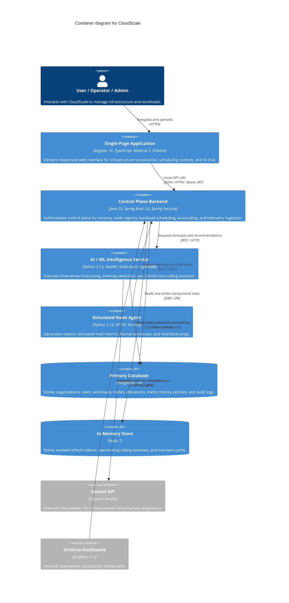

# C4 Level 2: Container Diagram — CloudScale

```mermaid
C4Container
    title Container diagram for CloudScale

    Person(user, "User / Operator / Admin", "Interacts with CloudScale to manage infrastructure and workloads.")

    Container(spa, "Single-Page Application", "Angular 19, TypeScript, Material 3, ECharts", "Delivers responsive web interface for infrastructure visualization, scheduling controls, and AI chat.")
    Container(controlPlane, "Control Plane Backend", "Java 25, Spring Boot 3.4, Spring Security", "Authoritative control plane for tenancy, node registry, workload scheduling, autoscaling, and telemetry ingestion.")
    Container(aiService, "AI / ML Intelligence Service", "Python 3.13, FastAPI, Scikit-learn, LightGBM", "Executes time-series forecasting, anomaly detection, and Gemini tool-calling assistant.")
    Container(nodeAgent, "Simulated Node Agent", "Python 3.13, HTTPX, NumPy", "Generates realistic simulated host metrics, diurnal workloads, and heartbeat pings.")
    
    ContainerDb(postgres, "Primary Database", "PostgreSQL 16", "Stores organizations, users, workloads, nodes, allocations, metric history, policies, and audit logs.")
    ContainerDb(redis, "In-Memory Store", "Redis 7", "Stores revoked refresh tokens, rate-limiting sliding windows, and transient cache.")
    
    Container_Ext(geminiApi, "Gemini API", "Cloud AI Service", "External LLM provider for conversational infrastructure diagnostics.")
    Container_Ext(grafana, "Grafana Dashboard", "Grafana 11.x", "Pre-built operational visualization dashboards.")

    Rel(user, spa, "Navigates and operates", "HTTPS")
    Rel(spa, controlPlane, "Issues API calls", "JSON / HTTPS / Bearer JWT")
    Rel(controlPlane, postgres, "Reads and writes transactional state", "JDBC / JPA")
    Rel(controlPlane, redis, "Checks token revocation & rate limits", "Lettuce Redis")
    Rel(controlPlane, aiService, "Requests forecasts and recommendations", "REST / HTTP")
    Rel(nodeAgent, controlPlane, "Pushes telemetry and heartbeats", "REST / HTTP")
    Rel(aiService, geminiApi, "Dispatches function-calling prompts", "HTTPS / gRPC")
    Rel(aiService, postgres, "Reads historical metrics for training", "SQLAlchemy (Read-Only)")
    Rel(grafana, controlPlane, "Scrapes metrics via Prometheus", "HTTP / Actuator")
```
