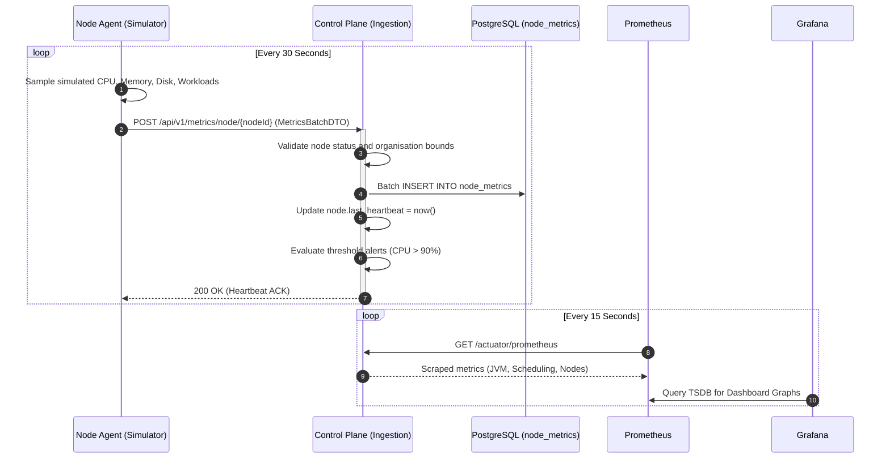
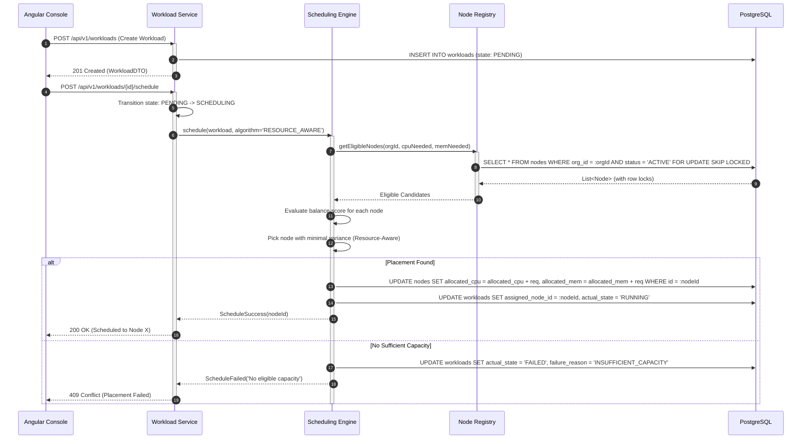
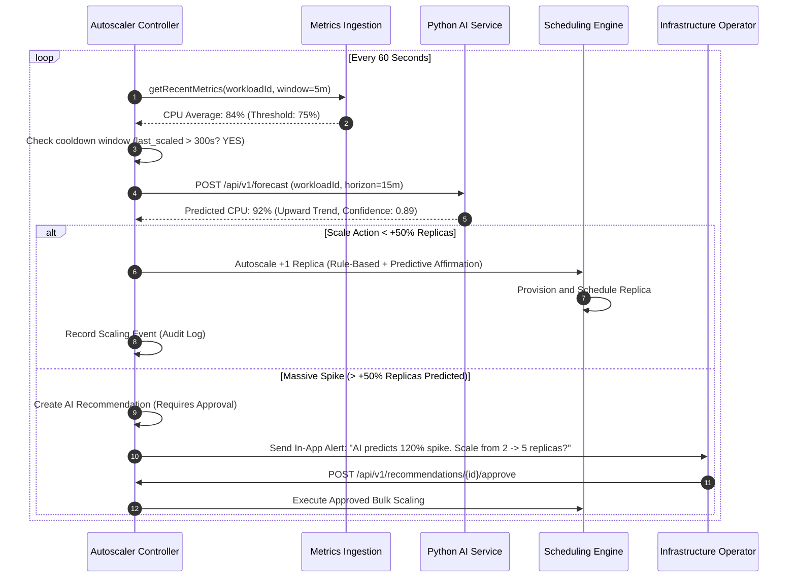

# Data Flow Diagrams — CloudScale

## 1. Telemetry Ingestion Flow

```mermaid
sequenceDiagram
    autonumber
    participant NA as Node Agent (Simulator)
    participant CP as Control Plane (Ingestion)
    participant PG as PostgreSQL (node_metrics)
    participant PR as Prometheus
    participant GF as Grafana

    loop Every 30 Seconds
        NA->>NA: Sample simulated CPU, Memory, Disk, Workloads
        NA->>CP: POST /api/v1/metrics/node/{nodeId} (MetricsBatchDTO)
        activate CP
        CP->>CP: Validate node status and organisation bounds
        CP->>PG: Batch INSERT INTO node_metrics
        CP->>CP: Update node.last_heartbeat = now()
        CP->>CP: Evaluate threshold alerts (CPU > 90%)
        CP-->>NA: 200 OK (Heartbeat ACK)
        deactivate CP
    end

    loop Every 15 Seconds
        PR->>CP: GET /actuator/prometheus
        CP-->>PR: Scraped metrics (JVM, Scheduling, Nodes)
        GF->>PR: Query TSDB for Dashboard Graphs
    end
```

## 2. Workload Placement & Scheduling Flow

```mermaid
sequenceDiagram
    autonumber
    participant UI as Angular Console
    participant WS as Workload Service
    participant SE as Scheduling Engine
    participant NR as Node Registry
    participant PG as PostgreSQL

    UI->>WS: POST /api/v1/workloads (Create Workload)
    activate WS
    WS->>PG: INSERT INTO workloads (state: PENDING)
    WS-->>UI: 201 Created (WorkloadDTO)
    deactivate WS

    UI->>WS: POST /api/v1/workloads/{id}/schedule
    activate WS
    WS->>WS: Transition state: PENDING -> SCHEDULING
    WS->>SE: schedule(workload, algorithm='RESOURCE_AWARE')
    activate SE
    
    SE->>NR: getEligibleNodes(orgId, cpuNeeded, memNeeded)
    activate NR
    NR->>PG: SELECT * FROM nodes WHERE org_id = :orgId AND status = 'ACTIVE' FOR UPDATE SKIP LOCKED
    PG-->>NR: List<Node> (with row locks)
    NR-->>SE: Eligible Candidates
    deactivate NR

    SE->>SE: Evaluate balance score for each node
    SE->>SE: Pick node with minimal variance (Resource-Aware)
    
    alt Placement Found
        SE->>PG: UPDATE nodes SET allocated_cpu = allocated_cpu + req, allocated_mem = allocated_mem + req WHERE id = :nodeId
        SE->>PG: UPDATE workloads SET assigned_node_id = :nodeId, actual_state = 'RUNNING'
        SE-->>WS: ScheduleSuccess(nodeId)
        WS-->>UI: 200 OK (Scheduled to Node X)
    else No Sufficient Capacity
        SE->>PG: UPDATE workloads SET actual_state = 'FAILED', failure_reason = 'INSUFFICIENT_CAPACITY'
        SE-->>WS: ScheduleFailed('No eligible capacity')
        WS-->>UI: 409 Conflict (Placement Failed)
    end
    deactivate SE
    deactivate WS
```

## 3. Autonomous Predictive Autoscaling Flow

```mermaid
sequenceDiagram
    autonumber
    participant AC as Autoscaler Controller
    participant MI as Metrics Ingestion
    participant AI as Python AI Service
    participant SE as Scheduling Engine
    participant OP as Infrastructure Operator

    loop Every 60 Seconds
        AC->>MI: getRecentMetrics(workloadId, window=5m)
        MI-->>AC: CPU Average: 84% (Threshold: 75%)
        AC->>AC: Check cooldown window (last_scaled > 300s? YES)
        
        AC->>AI: POST /api/v1/forecast (workloadId, horizon=15m)
        AI-->>AC: Predicted CPU: 92% (Upward Trend, Confidence: 0.89)

        alt Scale Action < +50% Replicas
            AC->>SE: Autoscale +1 Replica (Rule-Based + Predictive Affirmation)
            SE->>SE: Provision and Schedule Replica
            AC->>AC: Record Scaling Event (Audit Log)
        else Massive Spike (> +50% Replicas Predicted)
            AC->>AC: Create AI Recommendation (Requires Approval)
            AC->>OP: Send In-App Alert: "AI predicts 120% spike. Scale from 2 -> 5 replicas?"
            OP->>AC: POST /api/v1/recommendations/{id}/approve
            AC->>SE: Execute Approved Bulk Scaling
        end
    end
```
