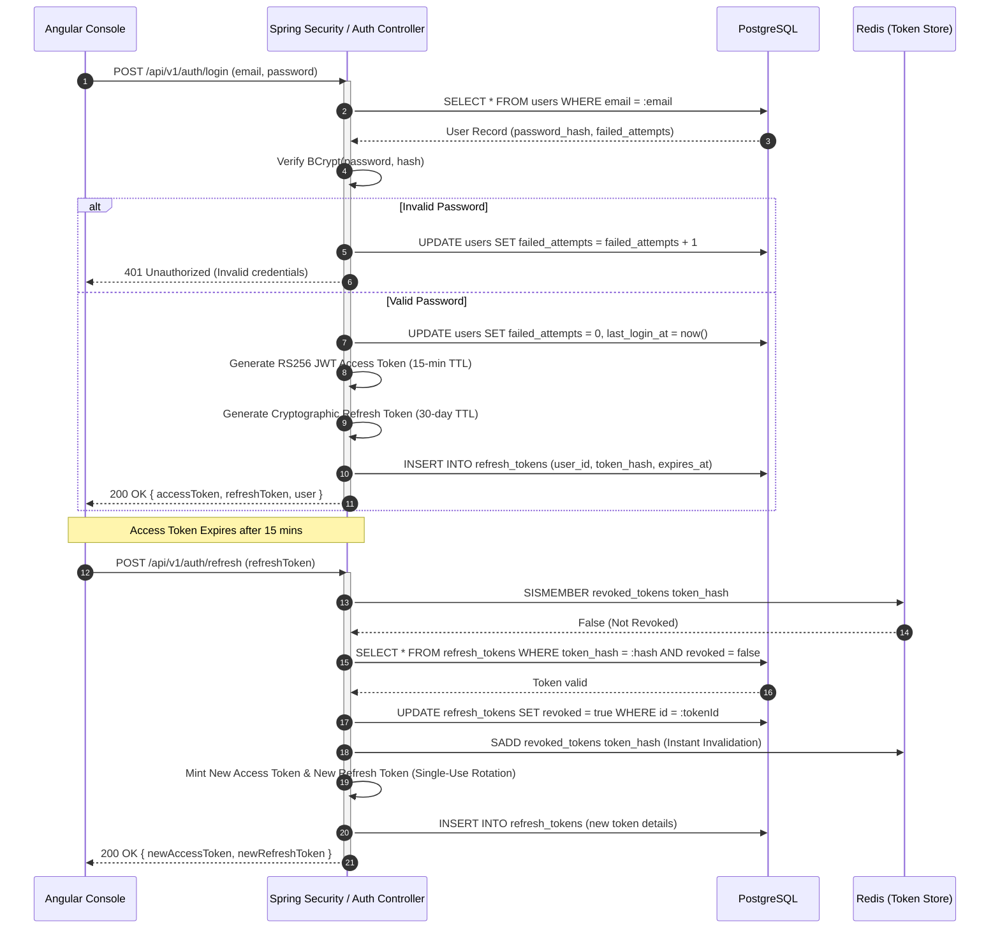
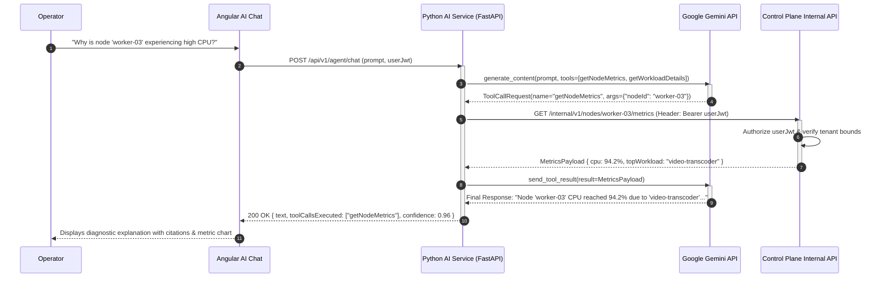

# Sequence Diagrams — CloudScale

## 1. Authentication & JWT Rotation Flow

```mermaid
sequenceDiagram
    autonumber
    participant Client as Angular Console
    participant Auth as Spring Security / Auth Controller
    participant DB as PostgreSQL
    participant Redis as Redis (Token Store)

    Client->>Auth: POST /api/v1/auth/login (email, password)
    activate Auth
    Auth->>DB: SELECT * FROM users WHERE email = :email
    DB-->>Auth: User Record (password_hash, failed_attempts)
    
    Auth->>Auth: Verify BCrypt(password, hash)
    alt Invalid Password
        Auth->>DB: UPDATE users SET failed_attempts = failed_attempts + 1
        Auth-->>Client: 401 Unauthorized (Invalid credentials)
    else Valid Password
        Auth->>DB: UPDATE users SET failed_attempts = 0, last_login_at = now()
        Auth->>Auth: Generate RS256 JWT Access Token (15-min TTL)
        Auth->>Auth: Generate Cryptographic Refresh Token (30-day TTL)
        Auth->>DB: INSERT INTO refresh_tokens (user_id, token_hash, expires_at)
        Auth-->>Client: 200 OK { accessToken, refreshToken, user }
    end
    deactivate Auth

    Note over Client, Auth: Access Token Expires after 15 mins

    Client->>Auth: POST /api/v1/auth/refresh (refreshToken)
    activate Auth
    Auth->>Redis: SISMEMBER revoked_tokens token_hash
    Redis-->>Auth: False (Not Revoked)
    Auth->>DB: SELECT * FROM refresh_tokens WHERE token_hash = :hash AND revoked = false
    DB-->>Auth: Token valid
    
    Auth->>DB: UPDATE refresh_tokens SET revoked = true WHERE id = :tokenId
    Auth->>Redis: SADD revoked_tokens token_hash (Instant Invalidation)
    Auth->>Auth: Mint New Access Token & New Refresh Token (Single-Use Rotation)
    Auth->>DB: INSERT INTO refresh_tokens (new token details)
    Auth-->>Client: 200 OK { newAccessToken, newRefreshToken }
    deactivate Auth
```

## 2. AI Assistant Tool-Calling Flow

```mermaid
sequenceDiagram
    autonumber
    participant User as Operator
    participant UI as Angular AI Chat
    participant AI as Python AI Service (FastAPI)
    participant Gemini as Google Gemini API
    participant CP as Control Plane Internal API

    User->>UI: "Why is node 'worker-03' experiencing high CPU?"
    UI->>AI: POST /api/v1/agent/chat (prompt, userJwt)
    activate AI
    AI->>Gemini: generate_content(prompt, tools=[getNodeMetrics, getWorkloadDetails])
    activate Gemini
    Gemini-->>AI: ToolCallRequest(name="getNodeMetrics", args={"nodeId": "worker-03"})
    deactivate Gemini

    AI->>CP: GET /internal/v1/nodes/worker-03/metrics (Header: Bearer userJwt)
    activate CP
    CP->>CP: Authorize userJwt & verify tenant bounds
    CP-->>AI: MetricsPayload { cpu: 94.2%, topWorkload: "video-transcoder" }
    deactivate CP

    AI->>Gemini: send_tool_result(result=MetricsPayload)
    activate Gemini
    Gemini-->>AI: Final Response: "Node 'worker-03' CPU reached 94.2% due to 'video-transcoder'..."
    deactivate Gemini

    AI-->>UI: 200 OK { text, toolCallsExecuted: ["getNodeMetrics"], confidence: 0.96 }
    deactivate AI
    UI-->>User: Displays diagnostic explanation with citations & metric chart
```
